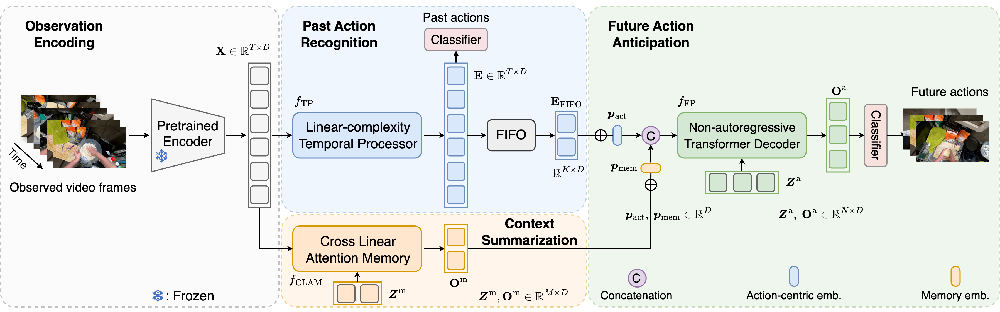

# Scalable Video Action Anticipation with Cross Linear Attentive Memory (WACV 2026)

## Abstract
ScalAnt is a sequence modeling framework for action anticipation. The codebase implements a query-based encoder-decoder predictor with optional memory clustering, trained with multi-label (action / verb / noun) objectives and evaluated with top-1 and mean top-5 recall metrics.
This is an official implementation of our [WACV 2026 paper](https://openaccess.thecvf.com/content/WACV2026/papers/Zhong_Scalable_Video_Action_Anticipation_with_Cross_Linear_Attentive_Memory_WACV_2026_paper.pdf).



## Method Overview
The model pipeline in [`main.py`](/home/zhong/Documents/projects/scalable-anticipation/main.py) and [`scalant/models/querypredictor.py`](/home/zhong/Documents/projects/scalable-anticipation/scalant/models/querypredictor.py):

1. **Input**: precomputed per-frame visual features over an observation window (`tau_o`) plus anticipation gap (`tau_a`).
2. **Encoder**: configurable temporal encoder (`MAMBA`, `GRU`, `LSTM`).
3. **Memory handling**: split into long-term and working memory; optional CLAM-based clustering over frame or semantic tokens.
4. **Query decoder**: transformer-style query decoder predicts future representation(s).
5. **Heads**: linear classifiers for action and optional verb/noun predictions on past/future tokens.
6. **Loss**: cross-entropy style losses with optional equalized loss for EPIC action imbalance.

## Repository Structure
- [`main.py`](/home/zhong/Documents/projects/scalable-anticipation/main.py): distributed train/val/test entrypoint.
- [`helper.py`](/home/zhong/Documents/projects/scalable-anticipation/helper.py): train/eval loops, optimizer/scheduler, checkpoint IO.
- [`scalant/datasets/epickitchens.py`](/home/zhong/Documents/projects/scalable-anticipation/scalant/datasets/epickitchens.py): EPIC-KITCHENS data processing and window sampling.
- [`scalant/models/`](/home/zhong/Documents/projects/scalable-anticipation/scalant/models): encoder, query decoder, classifier heads, optional CLAM.
- [`scalant/models/scan.py`](/home/zhong/Documents/projects/scalable-anticipation/scalant/models/scan.py): Triton implementation of sequential scan used by CLAM.
- [`scalant/criterion/`](/home/zhong/Documents/projects/scalable-anticipation/scalant/criterion): training losses and metric definitions.
- [`configs/ek100/default.yaml`](/home/zhong/Documents/projects/scalable-anticipation/configs/ek100/default.yaml): default experiment config.
- [`annotations/`](/home/zhong/Documents/projects/scalable-anticipation/annotations): EPIC-100 annotation assets used by the dataloader.

## How to Install
Create the environment from [`environment.yml`](/home/zhong/Documents/projects/scalable-anticipation/environment.yml):

```bash
conda env create -f environment.yml
conda activate scalant
```

If you already have the environment and want to sync updates:

```bash
conda env update -f environment.yml --prune
```

## Data Preparation
The EPIC dataloader expects:

1. Annotation files already present in this repo under:
   - `annotations/ek100_ori/*.pkl`
   - `annotations/ek100_ori/EPIC_100_{verb,noun}_classes.csv`
   - `annotations/ek100_rulstm/actions.csv`
2. Precomputed features and per-frame labels (download/source from [TeSTra](https://github.com/zhaoyue-zephyrus/TeSTra).
3. Place files with this directory structure (important):

```text
${DATA.DATA_ROOT_PATH}/
└── epickitchens100/
    └── features/
        ├── rgb_kinetics_bninception/      # this is DATA.FEAT_DIR
        │   ├── <video_id_1>.npy
        │   ├── <video_id_2>.npy
        │   └── ...
        ├── target_perframe/
        │   ├── <video_id_1>.npy
        │   └── ...
        ├── verb_perframe/
        │   ├── <video_id_1>.npy
        │   └── ...
        └── noun_perframe/
            ├── <video_id_1>.npy
            └── ...
```

Default config points to:
- `DATA.DATA_ROOT_PATH: /mnt/ssd/datasets`
- `DATA.FEAT_DIR: epickitchens100/features/rgb_kinetics_bninception`

Adjust these paths for your machine via config or `--opts`.

## Running Experiments
Default run (train + periodic validation):

```bash
python main.py
```

Override config values from CLI:

```bash
python main.py --opts SEED 123 TRAIN.BATCH_SIZE 64 TRAIN.LR 1e-3
```

Use a different config file:

```bash
python main.py --cfg configs/ek100/default.yaml
```

For SLURM usage, refer to [`expts/train_ek100.sh`](/home/zhong/Documents/projects/scalable-anticipation/expts/train_ek100.sh).

Submit the job:

```bash
sbatch expts/train_ek100.sh
```

Notes:
- The launcher uses `torch.multiprocessing.spawn` with `world_size=torch.cuda.device_count()`.
- Training uses all visible GPUs on one node.
- For single-GPU runs, set `CUDA_VISIBLE_DEVICES=0`.

## Logging, Checkpoints, and Metrics
- Checkpoints are saved to `checkpoints/<experiment_name>/checkpoint_best.pth`.
- Weights & Biases logging is controlled by `USE_WANDB` and `WANDB_PROJECT`.
- Primary metric default: `val/mt5r`.
- Tracked metrics include:
  - loss terms (`past_cls_loss`, `future_cls_loss`, optional verb/noun losses)
  - top-1 metrics (`past_top1`, `future_top1`)
  - recall metrics (`mt5r`, `verb_mt5r`, `noun_mt5r`)

## Poster
Poster: [assets/poster.png](assets/poster.png)

## Citation
If you use this repository, please consider citing our paper:

```bibtex
@inproceedings{zhong2026scalable,
  title={Scalable Video Action Anticipation with Cross Linear Attentive Memory},
  author={Zhong, Zeyun and Martin, Manuel and Schneider, David and Lerch, David J and Wu, Chengzhi and Diederichs, Frederik and Gall, Juergen and Beyerer, J{\"u}rgen},
  booktitle={Proceedings of the IEEE/CVF Winter Conference on Applications of Computer Vision},
  pages={8113--8123},
  year={2026}
}
```

## Akowledgements
- TeSTra: https://github.com/zhaoyue-zephyrus/TeSTra
- MiniROAD: https://github.com/jbistanbul/MiniROAD
